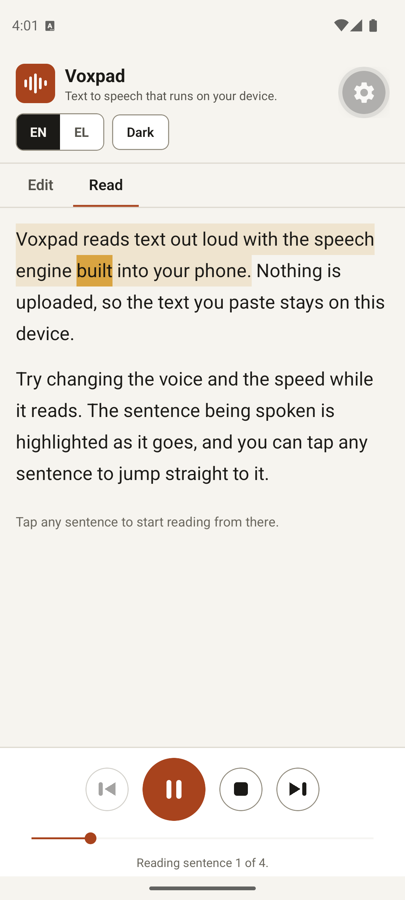
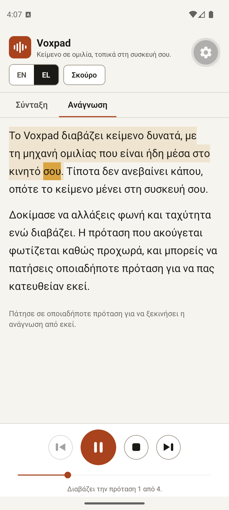

# Voxpad Mobile

A text to speech reader for Android and iOS, built with React Native, Expo and TypeScript. Paste
text, pick one of the voices installed on the device, and listen while the sentence being spoken
is highlighted. Nothing leaves the phone.

This is the native companion to [Voxpad for the web](https://github.com/DimNt3000/voxpad)
([live demo](https://dimnt3000.github.io/voxpad/)), which does the same job in the browser with
vanilla JavaScript on the Web Speech API. The two share the same architecture and the same
design language; what changed is the platform layer.

<p align="center">
  
  &nbsp;&nbsp;
  
</p>

<p align="center"><em>Both captured on an Android 16 emulator during playback through the Google TTS engine. Right: the Greek sample, read by the enhanced el-GR system voice after the app suggested switching to it.</em></p>

## What it does

- Reads any pasted text aloud through the platform speech engine (`expo-speech`).
- Highlights the sentence being spoken, and the word where the engine reports boundaries.
- Tap any sentence to start reading from there; drag the position slider to seek.
- Play, pause, resume, stop, and skip by sentence.
- Voice picker grouped by language, with enhanced quality voices marked and sorted first.
- Speed, pitch and volume, remembered between launches, with speed presets.
- Suggests a matching voice when the text is written in a non Latin script.
- Imports `.txt` and `.md` files through the system file picker.
- Two interface languages, English and Greek, switchable at runtime.
- Light and dark themes, following the system setting until you choose one.
- The draft text survives closing the app.

## Run it

```bash
npm install
npx expo start
```

Scan the QR code with [Expo Go](https://expo.dev/go) on your phone (Android or iOS). No Android
Studio or Xcode needed for development.

To produce an installable APK later, use [EAS Build](https://docs.expo.dev/build/setup/) with a
free Expo account: `npx eas build -p android --profile preview`.

There is also a web target (`npx expo start --web`), used mainly to smoke test the UI; the
canonical web app is the vanilla JS sibling project.

## How it works

### One architecture, two platforms

The core is shared with the web version almost line for line:

```
src/core/segmenter.ts    sentence splitting, counts, script detection (pure logic)
src/core/i18n.ts         English and Greek strings
src/core/prefs.ts        preferences and draft in AsyncStorage
src/speech/engine.ts     chunk-chaining playback engine over expo-speech
src/speech/voices.ts     voice discovery, grouping, sorting
src/components/          reader, voice picker, delivery sliders, transport bar
App.tsx                  controller wiring it all together
```

The engine speaks the text sentence by sentence instead of handing the whole document to the
platform. That gives it a cursor: it always knows which sentence is playing, which is what makes
highlighting, seeking, tap to jump and "next sentence" possible even when the engine never
reports word boundaries.

### Platform quirks the engine hides

| Problem | Handling |
| --- | --- |
| Android's `TextToSpeech` cannot pause, so `Speech.pause()` does not exist there | Pausing on Android stops the utterance but keeps the cursor; resuming restarts the current sentence |
| `stop()` fires the callback of the utterance it kills, which looks like normal completion | Every utterance carries a generation token; stale callbacks are ignored |
| Utterance settings are fixed once spoken | Changing voice, rate or pitch mid playback restarts the current sentence with the new settings |
| `getAvailableVoicesAsync()` returns an empty list while the Android TTS engine warms up | The loader retries on a backoff instead of trusting the first answer |
| Hermes has no `Intl.Segmenter` | The segmenter's hand written sentence scanner is the primary path on native; the `Intl` branch serves the web target |
| Word boundary events depend on the engine and voice | When they never arrive, the UI stays at sentence level highlighting |

### Rendering the reader

Sentences are nested `<Text>` spans inside per paragraph blocks, so the text flows like a
document rather than a list. Only the active sentence re-renders when a word boundary arrives,
and each paragraph reports its layout position so the reader can auto scroll to the sentence
being read.

## Privacy

No account, no backend, no analytics, no tracking. Preferences and the draft are stored in
AsyncStorage on the device. Speech is produced by the voices installed on the phone; whether a
given system voice synthesizes locally or on the vendor's servers is controlled by the OS speech
settings, not by this app.

## Verification

- `npx tsc --noEmit` passes with `strict` on.
- Tested on an Android 16 emulator (Pixel 7 AVD, Google Play image) through Expo Go: the Google
  TTS engine reports 472 voices, native word boundary events drive the word highlight, playback
  runs sentence to sentence to natural completion, and tap to jump works.
- Greek verified natively end to end: the script detector spots Greek text, offers the matching
  voice, and the enhanced el-GR system voice reads the Greek sample to completion with word
  boundaries arriving for Greek words too. Playback also survives a mid-read theme switch.
- The full UI flow (sample, play, pause, resume, stop, sentence stepping, tap to jump, voice
  picker, language and theme switching, clear confirmation, draft and preference persistence
  across restarts) was also exercised end to end on the web target, where `expo-speech` maps to
  the Web Speech API.
- The Android pause workaround is the code path the web target exercises too, since neither has
  a native pause.

## License

MIT, see [LICENSE](LICENSE). Built by Dimitrios-Georgios Ntoulias.
